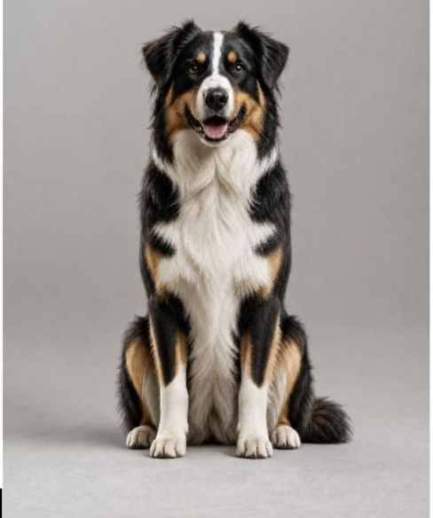
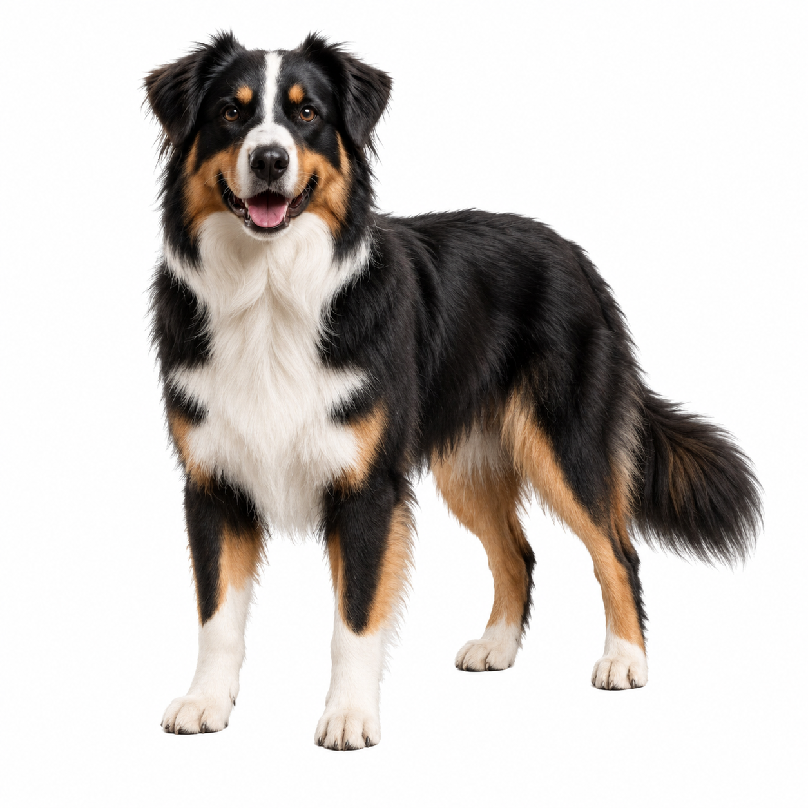
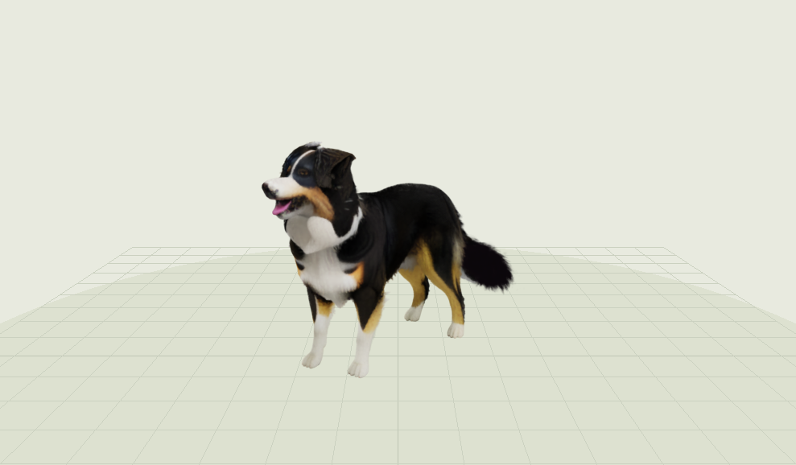
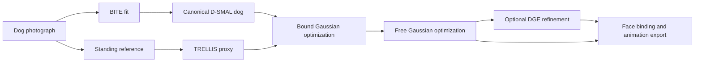

# GaussianDog

**Turn one dog photograph into an animatable 3D Gaussian dog.**

**Winner of the Huawei Hackathon Fetching Reality Challenge.**

[](https://www.python.org/)
[](https://developer.nvidia.com/cuda-toolkit)
[](https://github.com/runa91/bite_release/blob/master/LICENSE)

GaussianDog combines a fitted dog body with a detailed 3D Gaussian coat. It starts from a single photograph, estimates anatomy with [BITE](https://github.com/runa91/bite_release) and D-SMAL, generates a 3D appearance proxy with [TRELLIS](https://github.com/microsoft/TRELLIS), then optimizes and binds the Gaussians to the animatable surface.

This repository is an independent implementation of the reconstruction and binding ideas described in [SMAL-pets](https://arxiv.org/abs/2603.17131). Its executable code was developed for the Huawei Tricolor dog in [Doggin' Around](https://github.com/DzhanybekZakiriiaev/doggin-around).

<p align="center">
  
  
  
</p>

<p align="center"><b>Single photo → standing reference → animatable Gaussian dog</b></p>

**[Watch the 66-second animation demo](docs/media/gaussian-dog-demo.mp4)** showing a full 360-degree body rotation, all twelve actions, the fitted mesh, and the 35-joint skeleton.

## What it produces

- A fitted 3,889-vertex D-SMAL dog with 35 joints
- An anisotropic 3D Gaussian appearance
- Ten nearby face bindings for every Gaussian
- Twelve baked actions at 30 FPS
- A GLB inspection rig and binary full-vertex animation clips
- PLY, topology, binding, density, provenance, and validation files

The showcased reconstruction contains **37,525 real Gaussians** and ran at **60 FPS in Chrome at 1440 by 960** on the test Mac. The training run used 15,000 surface-bound steps, 25,000 free-Gaussian steps, and one optional 1,000-step DGE refinement pass.

## How it works



1. **Fit anatomy.** BITE estimates dog shape, limb proportions, pose, camera, and vertex offsets from the input photograph.
2. **Canonicalize the dog.** The fitted D-SMAL body moves into a normalized standing pose.
3. **Build the appearance target.** TRELLIS converts a standing reference into a Gaussian proxy and structural mesh.
4. **Optimize on the surface.** Four Gaussians per mesh face learn appearance while remaining attached to the body.
5. **Recover fur detail.** Gaussians become free to move while geometry, opacity, and scale regularizers keep the result stable.
6. **Bind and animate.** Every Gaussian follows ten nearby faces using rigid face frames, quaternion blending, and perimeter-based scale.

Read [the complete pipeline](docs/PIPELINE.md) and [the mathematical model](docs/MATH.md) for the implementation details.

## Supported inputs

GaussianDog is designed for **one centered photograph containing one dog**. BITE and D-SMAL are dog-specific, so this code does not reconstruct arbitrary objects or other animal species.

Standing or side-facing photos are the easiest inputs. A seated photo is supported by BITE, but the appearance stage works best with a separate standing reference that preserves the same face, ears, coat pattern, and proportions. Producing that reference is currently a manual generative image step.

## Hardware and software

| Component | Tested configuration | Guidance |
|---|---|---|
| Operating system | Ubuntu 22.04 | Linux is strongly recommended |
| GPU | NVIDIA RTX A6000, 48 GB | 24 GB may work with reduced settings but is not verified |
| System memory | 32 GB or more | 64 GB is safer for TRELLIS and exports |
| Storage | 100 GB | Checkpoints and intermediate views are large |
| Python | 3.10 | Use isolated environments |
| CUDA | 11.8 | Required for the tested PyTorch3D and gsplat stack |
| PyTorch | 2.4.0 | Use torchvision 0.19.0 |
| PyTorch3D | 0.7.9 | Build against the active CUDA toolkit |

TRELLIS officially requires at least 16 GB of GPU memory. Running BITE, TRELLIS, Gaussian training, and DGE on a single 48 GB GPU is the tested path. See [SETUP.md](docs/SETUP.md) for the exact environment order.

## Quick start

Clone this repository and prepare a Linux GPU environment:

```bash
git clone https://github.com/LarryWg/GaussianDog.git
cd GaussianDog

python3.10 -m venv .venv
source .venv/bin/activate
python -m pip install --upgrade pip setuptools wheel ninja
```

Install PyTorch and the local pipeline dependencies:

```bash
pip install torch==2.4.0 torchvision==0.19.0 --index-url https://download.pytorch.org/whl/cu118
pip install -r requirements.txt
```

BITE, TRELLIS, PyTorch3D, and optional DGE each require their own source checkout and license review. Continue with [SETUP.md](docs/SETUP.md), then run the commands in [PIPELINE.md](docs/PIPELINE.md).

The core stages are:

```bash
python scripts/bite/run.py --bite-source "$BITE_SOURCE" --image input.png --output work/bite-fit

python scripts/trellis_proxy.py --source "$TRELLIS_SOURCE" --image standing-reference.png --output work/proxy

python scripts/smal_pets/train.py \
  --bite-source "$BITE_SOURCE" \
  --bite-fit work/bite-fit/canonical.npz \
  --proxy-ply work/proxy/proxy.ply \
  --proxy-mesh work/proxy/proxy.obj \
  --output work/training

python scripts/smal_pets/export.py \
  --bite-source "$BITE_SOURCE" \
  --bite-fit work/bite-fit/canonical.npz \
  --checkpoint work/training/checkpoint.pt \
  --output work/export
```

The long fit resumes from `checkpoint.pt`, so interrupted GPU sessions do not need to restart from zero.

## Validation

CPU checks cover Gaussian PLY round trips, deterministic density ordering, rigid motion, articulation, scaling, quaternion normalization, and degenerate triangles.

```bash
pip install -r requirements-cpu.txt
make check
```

GPU validation additionally requires a successful BITE checkpoint load, CUDA rasterization with finite gradients, image inference, a finite optimization step, and gsplat rasterization.

## Results

The Huawei Tricolor run is documented in [RESULTS.md](docs/RESULTS.md). It includes held-out rendering metrics, deformation errors, contact limits, density decisions, and the reason the full DGE edit was not accepted.

## Research and attribution

GaussianDog builds on several research projects:

- [BITE: Beyond Priors for Improved Three-D Dog Pose Estimation](https://openaccess.thecvf.com/content/CVPR2023/html/Ruegg_BITE_Beyond_Priors_for_Improved_Three-D_Dog_Pose_Estimation_CVPR_2023_paper.html)
- [SMAL-pets: SMAL Based Avatars of Pets from Single Image](https://arxiv.org/abs/2603.17131)
- [3D Gaussian Splatting for Real-Time Radiance Field Rendering](https://repo-sam.inria.fr/fungraph/3d-gaussian-splatting/)
- [Structured 3D Latents for Scalable and Versatile 3D Generation](https://arxiv.org/abs/2412.01506)
- [DGE: Direct Gaussian 3D Editing by Consistent Multi-view Editing](https://arxiv.org/abs/2404.18929)

See [REFERENCES.md](docs/REFERENCES.md) for citations and official source links.

## License boundaries

The original code in this repository is released under the [MIT License](LICENSE). That license does not cover BITE, D-SMAL model data, TRELLIS weights, DGE, downloaded checkpoints, or generated assets governed by third-party terms.

BITE is released for non-commercial scientific research. You must read and accept its license before downloading or using its source, checkpoints, model data, or derivatives. This repository deliberately excludes those files.

The Huawei dog photographs and showcased outputs are included for project demonstration and attribution. Do not treat them as a general-purpose training dataset.

## Limitations

- The hidden side of a dog is inferred, not recovered from evidence in one photograph.
- A generated standing reference can change markings or proportions.
- Long or thin fur remains difficult for surface-based geometry.
- The final quality depends heavily on proxy alignment and visual inspection.
- The pipeline is research-oriented and is not yet a one-command consumer application.

## Support the project

If GaussianDog helps your research or project, consider starring the repository and sharing a result. Useful contributions include tested setup notes for other GPUs, better canonical reference generation, and new dog motion clips with clear licenses.
